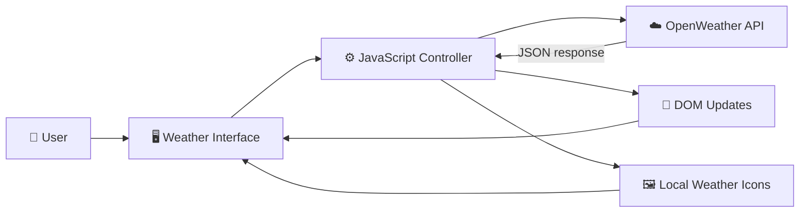
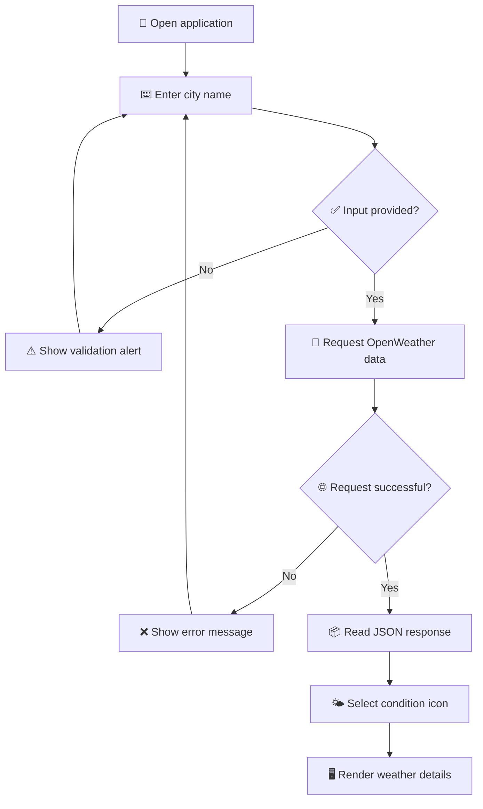
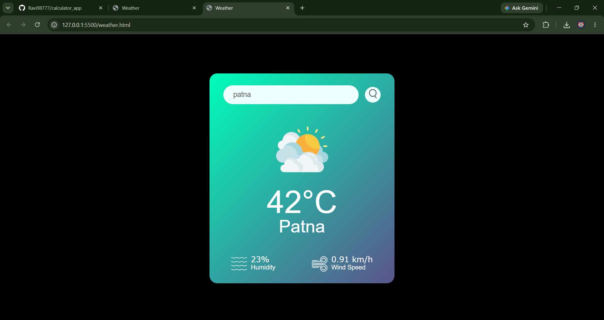
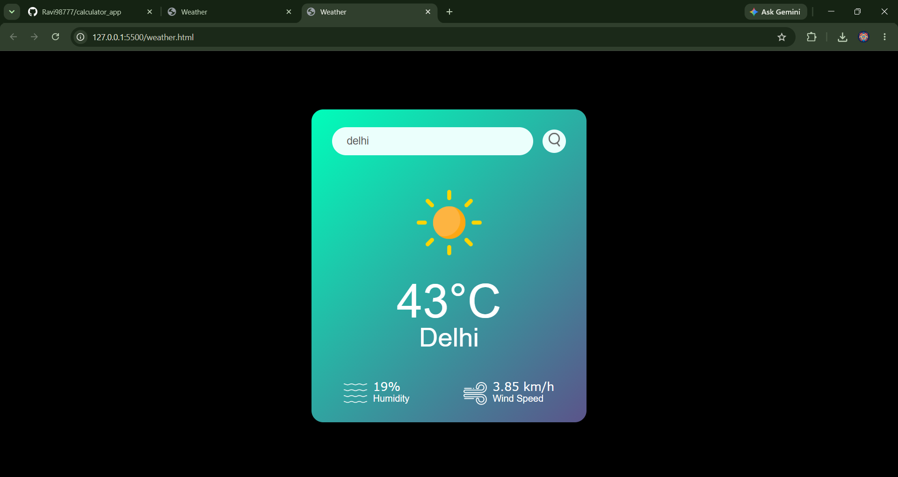

# 🌦️ Weather App

A clean and responsive weather application that retrieves live conditions for cities worldwide. Built with HTML, CSS, and vanilla JavaScript, the app uses the OpenWeather API to display temperature, humidity, wind speed, and a visual icon for the current weather.

## 📖 Overview

Weather App offers a quick way to check current weather conditions by city name. Users can search with the button or Enter key, receive clear feedback for invalid locations, and view an icon that changes according to the reported weather condition.

The project runs entirely in the browser and requires no framework, package manager, database, or build process.

## ✨ Features

- 🔎 Search current weather by city name
- 🌡️ Display temperature in degrees Celsius
- 💧 Show the current humidity percentage
- 💨 Display wind speed
- 🌤️ Change weather icons according to live conditions
- ⌨️ Search using the button or Enter key
- ⚠️ Show validation for empty or invalid searches
- 📱 Adapt to desktop and mobile screen sizes
- 🚀 Run as a lightweight static website

## 🧰 Tech Stack

| Technology | Purpose |
| --- | --- |
| 🌐 HTML5 | Defines the interface and weather information structure |
| 🎨 CSS3 | Provides the responsive card layout and visual styling |
| ⚙️ JavaScript | Handles searches, API requests, DOM updates, and errors |
| ☁️ OpenWeather API | Supplies live weather information by city |
| 🖼️ PNG assets | Represent search, humidity, wind, and weather conditions |

## 🌟 Project Highlights

- **Live weather data:** Retrieves current conditions directly from OpenWeather.
- **Condition-aware visuals:** Selects an appropriate icon for clear, cloudy, rainy, drizzly, or misty weather.
- **Asynchronous requests:** Uses `fetch()` with `async`/`await` for readable API logic.
- **Responsive design:** Keeps the weather card usable across different screen sizes.
- **Simple deployment:** Can be hosted on any static website platform.
- **Zero dependencies:** Does not require third-party JavaScript libraries or a compilation step.

## 🏗️ System Architecture

The application follows a client-side architecture. The browser receives user input, JavaScript sends a request to OpenWeather, and the returned JSON data is rendered into the interface.



### 🧩 Main Components

| Component | Responsibility |
| --- | --- |
| 🔎 Search input | Captures the requested city name |
| 🔘 Search button | Starts a weather lookup |
| 🌐 `checkweather()` | Requests and processes weather data |
| 🌡️ Weather display | Shows the city, temperature, humidity, and wind speed |
| 🌤️ Icon selector | Chooses an image based on the weather condition |
| ⚠️ Error message | Appears when a city cannot be found |

## 🔄 Application Workflow



### 🪜 Step-by-Step Flow

1. The user enters a city name.
2. A button click or Enter-key event starts the search.
3. JavaScript validates that the input is not empty.
4. `checkweather()` requests current conditions from OpenWeather.
5. The response is converted from JSON into a JavaScript object.
6. The page updates with the city, temperature, humidity, and wind speed.
7. The weather condition selects the corresponding local PNG icon.
8. Invalid city names display an error and hide previous weather results.

## 📁 Project Structure

```text
weather_project-main/
├── weather.html             # Application markup, styles, and JavaScript
├── weather.js               # Reserved JavaScript file (currently empty)
├── search.png               # Search button icon
├── clear.png                # Clear-weather icon
├── clouds.png               # Cloudy-weather icon
├── rain.png                 # Rain-weather icon
├── drizzle.png              # Drizzle-weather icon
├── mist.png                 # Mist-weather icon
├── snow.png                 # Snow-weather icon
├── humidity.png             # Humidity indicator
├── wind.png                 # Wind-speed indicator
├── weather_app demo.mp4     # live Demonstration video
└── README.md                # Project documentation
```

## 🚀 Getting Started

### ✅ Prerequisites

- A modern web browser
- An internet connection
- A valid [OpenWeather API key](https://openweathermap.org/api)

### 📥 Installation

1. Download or clone the project.
2. Keep `weather.html` and all PNG assets in the same folder.
3. Open `weather.html` in a text editor.
4. Replace the existing API key with your own key:

```javascript
const apikey = "YOUR_OPENWEATHER_API_KEY";
```

5. Open `weather.html` in your browser.

### 🖥️ Optional Local Server

If your browser restricts API requests from a local file, serve the project directory locally:

```bash
python -m http.server 8000
```

Then visit `http://localhost:8000/weather.html`.

## 🎯 Usage

1. Enter a city name in the search field.
2. Select the search icon or press Enter.
3. View the current temperature, humidity, wind speed, and weather icon.
4. Search another city to refresh the displayed data.

For cities with identical names, include a country code—for example, `London, GB` or `London, CA`.

## 📸 Screenshots

### 🏠 Weather Search Result 1



### 🌧️  Weather Search Result 2


### 🌧️  Weather Search Result 3




### 🌧️   Demonstration


> Create a `screenshots` folder and save the images as `weather-app.png` and `weather-result.png` to display them here.

## 🔐 Security and Configuration

The current project sends requests directly from frontend JavaScript, which makes the API key visible to browser users. Before a public production deployment:

- Move API requests to a backend or serverless function.
- Store the key in a server-side environment variable.
- Apply usage restrictions and request limits in the API provider dashboard.
- Revoke and replace any API key that has been published publicly.

## 📝 Important Notes

- `weather.html` references `default.png`, but that file is not currently included. Add a fallback image or update the default icon logic.
- `snow.png` is included but is not currently selected by the JavaScript condition switch.
- OpenWeather reports wind speed in metres per second when metric units are requested. Convert it before displaying `km/h` if that label is retained.
- The temperature text should use the proper `°C` symbol if an encoding artifact appears.

## 🔮 Future Improvements

- 📍 Detect the user's location with the Geolocation API
- 📅 Add hourly and multi-day forecasts
- 🌅 Display sunrise and sunset times
- 🌡️ Provide Celsius and Fahrenheit switching
- ❄️ Connect the existing snow icon to snowy conditions
- 🌓 Add light and dark themes
- 🕘 Save and display recent searches
- 🧭 Show pressure, visibility, and wind direction
- ♿ Improve keyboard navigation and accessibility feedback
- 🔒 Move API access to a secure backend service
- 🧪 Add automated tests for requests and interface states

## 🙏 Acknowledgements

- Weather information is provided by [OpenWeather](https://openweathermap.org/).
- Weather, search, humidity, and wind graphics are included as local project assets.
- Thanks to the web-development community for documentation and learning resources related to browser APIs and responsive design.

## 👨‍💻 Author

**Ravi Kumar Sharma**

Created as a frontend development project demonstrating API integration, asynchronous JavaScript, DOM manipulation, responsive design, and dynamic visual states.

## 📄 License

This project is intended for educational and personal use. Add a `LICENSE` file before distributing it under a specific open-source license.

